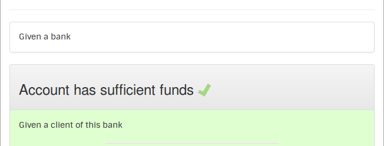

# Manage test context

Use JUnit annotation @Before, @After and @BeforeClass, @AfterClass to manage test context before and after each scenario, before and after all scenarios.

Show scenario context: add @Displayable on private or protected field to displayed it.

    ...
	public class AccountHolderWithdrawCash {
	    ...
        private Object ticket = null;
        ...

[Back](./README.md)

### Share fixtures

All public fixtures from an class annotated by @FixtureHelper can be used as local fixture.

Create public fixtures in a fixture helper: 

    ...
	public class BankHelper {
		...
	    @Text("Given the account balance is ${initialAmount} $")
	    public void givenTheAccountBalanceIs(int initialAmount) {
	        ...
	    }
    	...
	}

Reference the FixtureHelper and call its fixture: 

	...
	public class AccountHolderWithdrawCash {
		@FixturesHelper
	    private BankHelper bankHelper = new BankHelper();
		...
		@Test
    	public void accountHasSufficientFunds() {
        	bankHelper.givenTheAccountBalanceIs(100);
        	...
        }
        ...
    }

[Back](./README.md)
