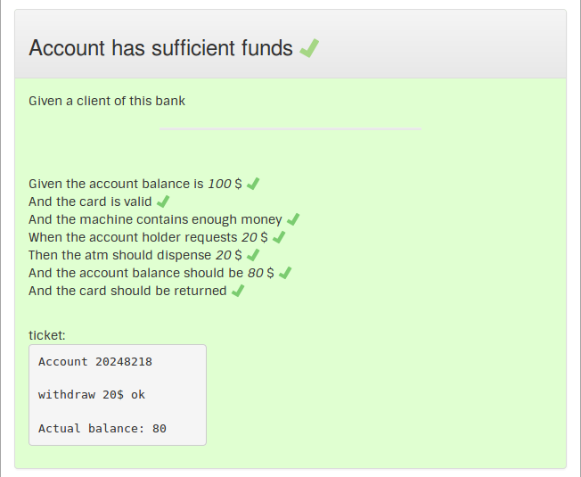
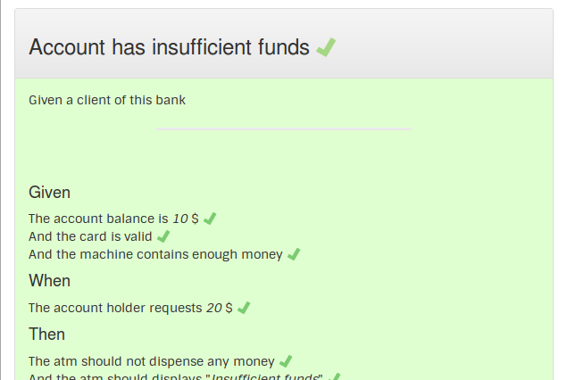

# SimpleFunctionalTest

A JUnit extension to easily adopt functional testing and acceptance testing

## 1 step: make your test readable

In JUnit test refactor your test in order to make it more readable by non java native speaker.

* Add comment before class or test method
* Use expressive names (camelCase or underscore) for your class, test methods and other methods
* In your test ONLY use method calls

A 'more' readable JUnit test for a non native java speaker:

	...
	/*
	As an Account Holder
	I want to withdraw cash from an ATM
	So that I can get money when the bank is closed
	*/
	public class AccountHolderWithdrawCash {
		...
		@Test
		public void accountHasSufficientFunds() {
			givenTheAccountBalanceIs100Dollars();
			andTheCardIsValid();
			andTheMachineContainsEnoughMoney();

			whenTheAccountHolderRequests20Dollars();

			thenTheAtmShouldDispense20Dollars();
			andTheAccountBalanceShouldBe80Dollars();
			andTheCardShouldBeReturned();
		}

		private void givenTheAccountBalanceIs100Dollars(){
		    ...
		}
        ...
	}

## 2 step: add SimpleFunctionalTest
In your pom file insert dependencies to SimpleFunctionalTest

	<project>
		...
		<dependencies>
			...
			<dependency>
				<groupId>com.github.slezier</groupId>
				<artifactId>SimpleFunctionalTest</artifactId>
				<version>1.4</version>
				<scope>test</scope>
			</dependency>
		</dependencies>
	</project>

and specify SimpleFuntionalTest as JUnit runner:

	...
	@RunWith(SimpleFunctionalTest.class)
	public class AccountHolderWithdrawCash {
		...

## 3 step: enjoy
Run the test.

Open the html file generated:

## Other fixtures
[Use weirds characters or specify the way is displayed](./Text.md "Title") inline link.

### Use &~"#'{([-|\^@°)]+=}$£%*?./§,;:! characters or specify the way your test is displayed
Annotate class and method with @Text("The text that should be displayed!!!").

    ...
    @Text("Given the account balance is 100$")
    private void givenTheAccountBalanceIs100Dollars(){
        ...

### Parameterize your fixture
Add ${myParameterName} to displayed value used when called.

    ...
    @Text("Given the account balance is ${initialAmount} $")
    private void givenTheAccountBalanceIs(int initialAmount) {
        ...

### Links use cases together
Add a public field, it'll be run as a related use case with SimpleFunctionalTest.

    ...
	public class AccountHolderWithdrawCash {
	    ...
        public  AccountHolderWithdrawCashAlternateCases alternateCases = new AccountHolderWithdrawCashAlternateCases();
        ...

A new section is added  with all related use cases:

### Manage test context

Use JUnit annotation @Before, @After and @BeforeClass, @AfterClass to manage test context before and after each scenario, before and after all scenarios.

Show scenario context: add @Displayable on private or protected field to displayed it.

    ...
	public class AccountHolderWithdrawCash {
	    ...
        private Object ticket = null;
        ...

### Share fixtures

All public fixtures from an class annotated by @FixtureHelper can be used as local fixture.

Create public fixtures in a fixture helper: 

    ...
	public class BankHelper {
		...
	    @Text("Given the account balance is ${initialAmount} $")
	    public void givenTheAccountBalanceIs(int initialAmount) {
	        ...
	    }
    	...
	}

Reference the FixtureHelper and call its fixture: 

	...
	public class AccountHolderWithdrawCash {
		@FixturesHelper
	    private BankHelper bankHelper = new BankHelper();
		...
		@Test
    	public void accountHasSufficientFunds() {
        	bankHelper.givenTheAccountBalanceIs(100);
        	...
        }
        ...
    }

### Decorate
#### Add table of content
On class level add @Decorate(decorator = TableOfContent.class)

	...
	@Decorate(decorator = TableOfContent.class)
	public class AccountHolderWithdrawCash {
	    ...
        public  AccountHolderWithdrawCashAlternateCases alternateCases = new AccountHolderWithdrawCashAlternateCases();
        ...
	}

#### Add breadcrumb
On class level add @Decorate(decorator = Breadcrumb.class)

	@Decorate(decorator = Breadcrumb.class)
	public class AccountHolderWithdrawCashAlternateCases {

#### Group fixtures
For each fixture to group add @Decorate(decorator = Group.class,parameters = "Group title")

	...
	public class AccountHolderWithdrawCash {
		...
    	@Test
    	public void accountHasSufficientFunds() {
        	bankHelper.theAccountBalanceIs(100);
        	bankHelper.andTheCardIsValid();
        	bankHelper.andTheMachineContainsEnoughMoney();
        	...
        }
        ...
    ...

	public class BankHelper {
		...
	    @Decorate(decorator = Group.class,parameters = GIVEN)
	    @Text("The account balance is ${initialAmount} $")
	    public void theAccountBalanceIs(int initialAmount) {
	        ...
	    }
	    ...
	    @Decorate(decorator = Group.class,parameters = GIVEN)
	    public void andTheCardIsValid() {
	    	...
	    }
	    ...
	    @Decorate(decorator = Group.class,parameters = GIVEN)
	    public void andTheMachineContainsEnoughMoney() {
	        ...
	    }
	    ...
	}

#### Display fixtures as table
On fixture level add  @Decorate(decorator = Table.class,parameters = "Table title")

	public class AccountHolderWithdrawCashAlternateCases {
		...
		@Test
	    public void  maximumWithdraw(){
	        ...
	        whenTheAccountHolderRequestsThenTheAtmProvidesCash(10,10);
	        whenTheAccountHolderRequestsThenTheAtmProvidesCash(10,10);
	        whenTheAccountHolderRequestsThenTheAtmProvidesCash(10,10);
	        whenTheAccountHolderRequestsThenTheAtmProvidesCash(10,10);
	        whenTheAccountHolderRequestsThenTheAtmProvidesCash(10,10);
	        whenTheAccountHolderRequestsThenTheAtmProvidesCash(10, 0);
	    }
	    ...
    	@Decorate(decorator = Table.class,parameters = "withdraws and cash received per visit")
    	private void whenTheAccountHolderRequestsThenTheAtmProvidesCash(int amount, int cash) {
    		...
    	}
    	...
    }

## Deeper
[How to use SimpleFunctionalTest](http://htmlpreview.github.io/?http://github.com/slezier/SimpleFunctionalTest/blob/master/target/sft-result/sft/integration/HowToUseSimpleFunctionalTest.html)

Available release:

- 1.5: Bug fix [jar](search.maven.org/remotecontent?filepath=com/github/slezier/SimpleFunctionalTest/1.5/SimpleFunctionalTest-1.5.jar) [doc](http://htmlpreview.github.io/?http://github.com/slezier/SimpleFunctionalTest/blob/SimpleFunctionalTest-1.5/target/sft-result/sft/integration/HowToUseSimpleFunctionalTest.html)
- 1.4: Bug fix [jar](search.maven.org/remotecontent?filepath=com/github/slezier/SimpleFunctionalTest/1.4/SimpleFunctionalTest-1.4.jar) [doc](http://htmlpreview.github.io/?http://github.com/slezier/SimpleFunctionalTest/blob/SimpleFunctionalTest-1.4/target/sft-result/sft/integration/HowToUseSimpleFunctionalTest.html)
- 1.3: Decorators and setting [jar](search.maven.org/remotecontent?filepath=com/github/slezier/SimpleFunctionalTest/1.3/SimpleFunctionalTest-1.3.jar) [doc](http://htmlpreview.github.io/?http://github.com/slezier/SimpleFunctionalTest/blob/SimpleFunctionalTest-1.3/target/sft-result/sft/integration/HowToUseSimpleFunctionalTest.html)
- 1.2: Using test context [jar](search.maven.org/remotecontent?filepath=com/github/slezier/SimpleFunctionalTest/1.2/SimpleFunctionalTest-1.2.jar) [doc](http://htmlpreview.github.io/?http://github.com/slezier/SimpleFunctionalTest/blob/SimpleFunctionalTest-1.2/target/sft-result/sft/integration/HowToUseSimpleFunctionalTest.html)
- 1.1: Basic testing: UseCase Scenario Fixture SubUseCase and FixtureHelper [jar](search.maven.org/remotecontent?filepath=com/github/slezier/SimpleFunctionalTest/1.1/SimpleFunctionalTest-1.1.jar) [doc](http://htmlpreview.github.io/?http://github.com/slezier/SimpleFunctionalTest/blob/SimpleFunctionalTest-1.1/target/sft-result/sft/integration/HowToUseSimpleFunctionalTest.html)

